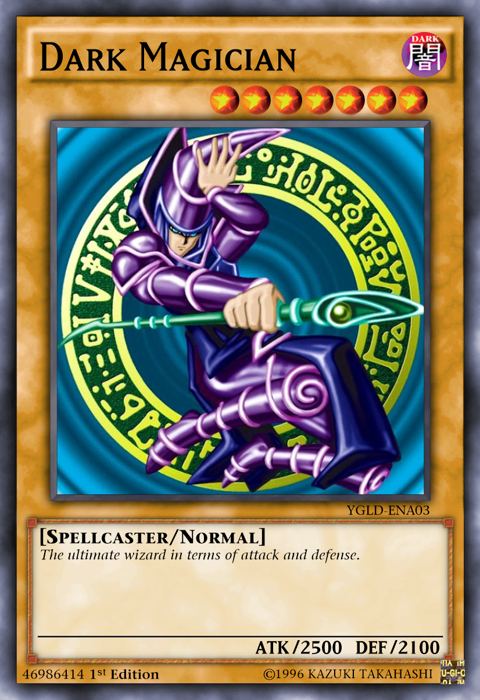

# Yugioh.Draw

Simple .NET core library to create high quality Yu-Gi-Oh cards.

### Example Usage

```csharp
string resourcesPath = Path.GetFullPath(@"path\to\resources");
IResourceRepository resourceRepository = new ResourceRepository(resourcesPath);

new CardBuilder(resourceRepository, Frame.Normal,
    @"C:\Users\MyUser\Downloads\DARK_MAGICIAN_ARTWORK.png")
    .AddAttribute(Attribute.Dark)
    .AddName("Dark Magician", Brushes.Black)
    .AddLevel(Level.Seven)
    .AddNumber("YGLD-ENA03", Brushes.Black)
    .AddMonsterType(new List<string>() { "Spellcaster", "Normal" })
    .AddDescription("The ultimate wizard in terms of attack and defense.", Brushes.Black)
    .AddAtkAndDef("2500", "2100", Brushes.Black)
    .AddPasscode("46986414", Brushes.Black)
    .AddEditionAndHologram(Edition.First, Brushes.Black)
    .AddCreator("1996 KAZUKI TAKAHASHI", Brushes.Black)
    .Build()
    .Save($"EXAMPLE__DARK_MAGICIAN.png", ImageFormat.Png);
```
#### Sample output:

<p align="center">
  
<p>

### Usage

This project must not be used for any commercial use. This is just a sample repository to hone skills of the language and nothing more.